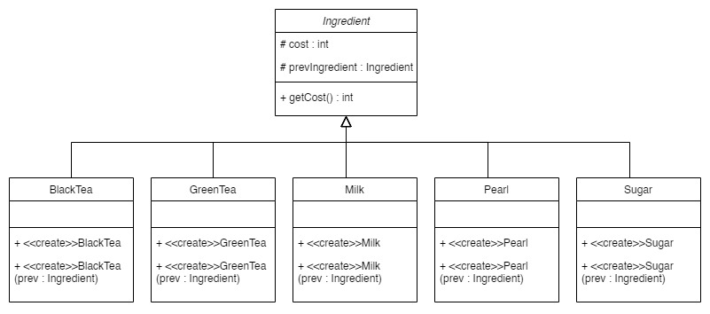

### OOP ASSIGNMENT 4
##### Update Date: 2023/ 5/ 26
計算價格時，除了本身價格外，還需加上前面加過的成分價格，所以參考Chain of Responsibility的模式，使每個價格都可以考慮到前面成分的價格



---
### Ingredient
`abstract class Ingredient()`為所有原物料的父類別

**About Cost**
因為cost的計算都要先確認是否為ingredient的instance才能知道價格總合，所以直接寫在抽象類別中
```java
protected int cost = 0 ;

public int getCost() {
  if ( prevIngredient_ instanceof Ingredient ) return cost + prevIngredient_.getCost() ;
  return cost ;
} // getCost()

```

**prevIngredient_**
除了自己的價格外，還要參考前面的成分價格，如果只有自己的這個，像是只點一杯牛奶，此時prevIngredient就會指向null
```java
protected Ingredient prevIngredient_ = null ;
```

### Subclass of Ingredient
在建構子裡直接連接上上一個加入的成分，即能將每個成分以像是linked list的方式連結在一起（這裡以Milk為例）
`this.cost`用來設定價格
```java
Milk( Ingredient prev ) {
  this.cost = 20 ;
  prevIngredient_ = prev ;
} // constructor
```